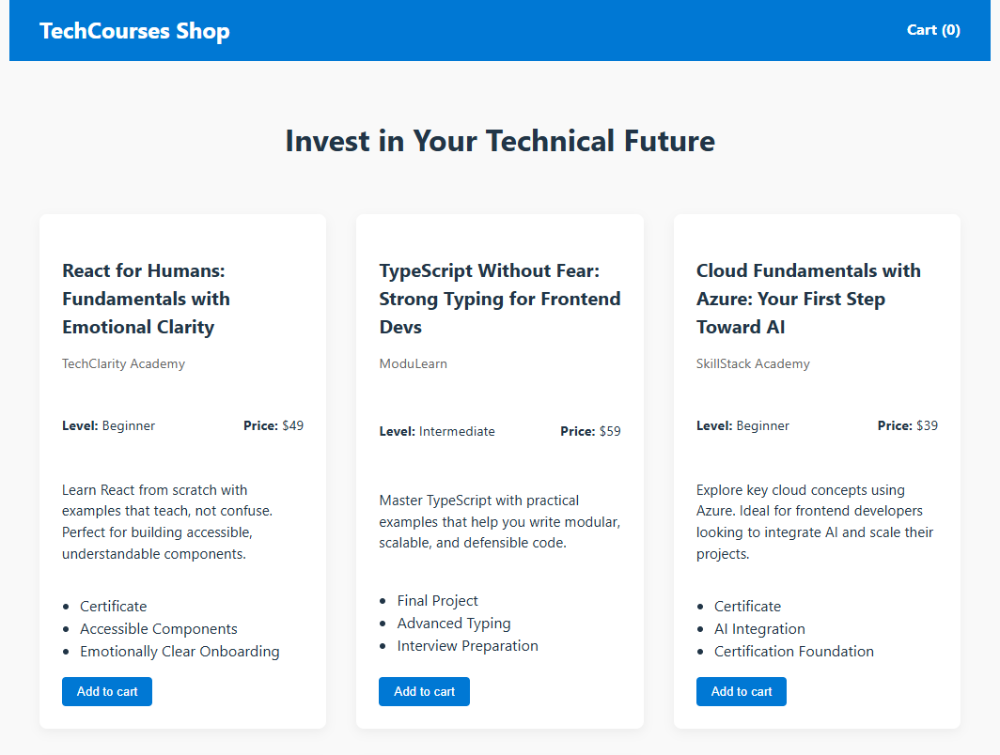

# **TechCourses Shop**

This project is part of my **React Practice Series**, a personal collection of frontend exercises focused on improving fluency, architectural clarity, and emotionally intelligent UI design.



---

## **Purpose**

To practice:

- Global state management with **Redux Toolkit**
- Modular React components with clear separation of concerns
- Shopping cart flow with quantity controls and dynamic subtotal
- **Modal** and overlay patterns for contextual interactions
- **Global notification system** for instant user feedback
- **Async data fetching** with thunks and loading/error states
- Consistent, responsive styling with pure CSS

---

## **Features**

- **Course listing** fetched from an API via `fetchCourses` thunk
  - Loading state (`status: 'loading'`)
  - Success state with populated course catalog
  - Error state with user-friendly feedback
- **Shopping cart**:
  - Add courses (increments quantity if already in cart)
  - Increase / decrease quantity directly from the cart
  - Remove individual courses
  - Real-time subtotal calculation
  - **Checkout** button that clears the cart and shows a success notification
- **Cart modal** with overlay and close via button or outside click
- **Global notifications** (`Notification`) for immediate feedback:
  - Success on add, remove, or checkout
  - Distinct styles for `success`, `error`, `info`, and `warning`
- **Global state** with Redux Toolkit:
  - `courseCatalogSlice` for course fetching and catalog state
  - `shoppingCartSlice` for cart logic
  - `notificationSlice` for feedback
- **Responsive CSS** for mobile, tablet, and desktop

---

## **Structure**

- `components/`: Modular UI (NavBar, Cart, CartItem, CourseCard, Notification)
- `store/slices/`:
  - `courseCatalogSlice.js` – Handles course fetching and catalog state
  - `shoppingCartSlice.js` – Handles cart logic
  - `notificationSlice.js` – Handles global feedback
- `store/thunks/`:
  - `coursesThunks.js` – Contains `fetchCourses` async thunk
- `styles/`: Global and component-level CSS
- `App.jsx`: Main layout and notification mounting

---

## **Design Notes**

This project is built to be **teachable and maintainable**.
Each slice has a single, clear responsibility:

- **`courseCatalogSlice`**: Manages the course list, loading state, and errors.
- **`shoppingCartSlice`**: Manages cart items, quantities, and totals.
- **`notificationSlice`**: Manages global feedback messages.

The notification system is decoupled from the cart UI, making it reusable across the entire application.

---

## **Technologies Used**

- **React** – Component-based UI development
- **Redux Toolkit** – Global state management
- **React-Redux** – Binding between Redux and React
- **Vite** – Fast development environment
- **CSS** – Custom, responsive styling

---

## **Getting Started**

### **Installation & Setup**

1. Clone the repository:

```bash
  git clone https://github.com/maitepv87/techcourses-shop.git
  cd techcourses-shop
```

2. Install dependencies:

```bash
  npm install
```

3. Start the development server:

```bash
  npm run dev
```

Then open http://localhost:3000 in your browser.
